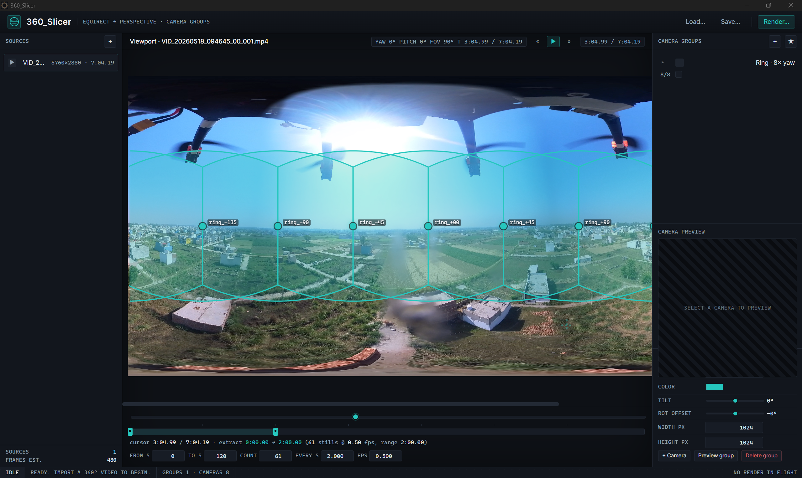

# 360 Extractor

**Equirectangular 360° video → curated perspective image sets for photogrammetry & 3D Gaussian Splatting.**

By **Dr. Ankush Rai**



---

## What it is

360 Extractor is a desktop application (Windows, Tauri + Rust) that turns
footage from 360-degree cameras (Insta360, GoPro Max, Ricoh Theta, or any
equirectangular MP4 / MOV / MKV) into clean perspective stills suitable
for training:

- **Structure-from-Motion / photogrammetry** pipelines
  (RealityCapture, Metashape, Meshroom, OpenMVG, COLMAP, …)
- **3D Gaussian Splatting** trainers
  (gaussian-splatting, Nerfstudio gsplat, Brush, …)
- Any **NeRF / radiance-field** pipeline that expects pinhole-camera images.

Instead of feeding raw equirectangular frames — which photogrammetry and
splatting solvers cannot calibrate correctly — the tool re-projects each
timestamp into N pinhole virtual cameras at operator-defined yaw / pitch /
FOV, writes them to disk as PNG/JPG, and groups them per source and per
camera ring.

---

## Why it exists

Modern 360 cameras are by far the cheapest way to capture a scene from
every direction at once. But every SfM and splatting trainer expects
**pinhole / perspective** images with a finite, known field of view. Fed
an equirectangular panorama, they either fail to triangulate or produce
warped reconstructions.

The bridge — slicing each equirectangular frame into a curated set of
overlapping perspective views — is mechanical, repetitive, and tedious to
do by hand or with ad-hoc ffmpeg scripts. 360 Extractor turns it into a
visual, project-based workflow with templates, previews, and batch
rendering.

---

## Highlights

- **Project-based** — sources, camera groups, sampling windows and render
  settings live in a single JSON file. Save, reload, share.
- **Camera groups** are reusable rigs of virtual pinhole cameras. Each
  camera carries `yaw`, `pitch`, `fov`, and a `bypassed` flag for
  directions you want to skip (e.g. one that always sees the operator).
- **Group transforms**: `TILT` (group pitch offset) and `ROTATION_OFFSET`
  (group yaw offset) let you rotate an entire rig with one knob. Per-group
  output resolution (`width × height`).
- **Three starter templates** ship in-app:
    - `Ring · 8× yaw` — eight 90°-FOV cameras spaced every 45° around the
      horizon. SfM-friendly (≈50% inter-view overlap). The default.
    - `Cube · 6 faces` — classic cubemap (front/right/back/left/up/down).
    - `Drone Narrow · forward-down` — 4 cameras biased forward and down,
      tilted -25°, for nadir / oblique mapping passes.
- **Sampling control**: per-source start / end timestamps, sample interval
  in seconds, visual range strip + scrubber on the timeline.
- **Per-source × per-group assignment** — apply only some rigs to some
  videos, or leave the assignment empty for "use every group".
- **Live preview** — render a single timestamp through a group before
  committing to a full export, so you can sanity-check yaw/pitch/FOV.
- **Batched rendering** via ffmpeg's `v360 → split → crop` filtergraph:
  one ffmpeg invocation per (source, group, timestamp), all cameras of
  the group emitted in parallel.
- **Cooperative cancel** + per-frame progress events streamed to the UI
  on `render://stage`.
- **Output layout**:
    ```
    <render.output_dir>/
      <source_basename>/
        <group_name>/
          <source>_<label>_t<timestamp>.png
    ```
  Drop a group folder straight into your SfM / splatting trainer.

---

## How rendering works

For each (source video × assigned camera group × sampled timestamp):

1. Effective per-camera orientation is computed as
   `yaw_eff   = wrap180(camera.yaw + group.rotation_offset)`
   `pitch_eff = clamp(camera.pitch + group.tilt, -90°, +90°)`.
2. `bypassed` cameras are dropped.
3. ffmpeg is invoked once with a `v360=equirect:rectilinear` chain that
   produces every live camera in the group from the single equirect
   input frame at time `t`.
4. PNG (lossless, default — recommended for SfM) or JPG is written into
   the per-source / per-group output folder.

The render pipeline runs in a worker thread; the UI subscribes to
`render://stage` and renders the progress bar / failure list from those
events.

---

## Recommended capture & export tips

- **Stitch first.** Use the camera vendor's tool (Insta360 Studio, GoPro
  Player, Theta Stitcher) to export a stitched **equirectangular 2:1**
  MP4 / MOV. Unstitched dual-fisheye is not supported.
- **Keep the camera level** — `tilt` is a global correction, not a
  per-frame IMU compensation.
- **Sampling interval** = (camera move speed × overlap target). For a
  walking handheld at ~1 m/s with 8 cameras at 90° FOV, a 1–2 s interval
  gives generous overlap.
- **Bypass the down camera** when the operator / tripod is in frame.
- **Output PNG** for SfM, JPG only when you are tight on disk for very
  long shoots.
- **Match `width × height`** to your trainer's expected input
  (typically 1024² or 1600² for splatting, larger for photogrammetry).

---

## Project file format

Projects save to a versioned JSON with `version: 1`. Top-level keys:

| key       | meaning                                                |
| ---       | ---                                                    |
| `name`    | human label                                            |
| `sources` | array of video sources, each with a sampling window    |
| `groups`  | array of camera groups (rings / cubes / custom rigs)   |
| `render`  | global output dir + format (`png` / `jpg`)             |

Each source can pin specific group IDs in `group_ids`. Empty array =
apply **all** groups to that source. Round-trips are stable and tests
guard backward compatibility.

---

## Status

- Platform: Windows (Tauri 2, MSI / NSIS installers).
- macOS / Linux builds: not yet packaged — the Rust core is portable,
  only the bundle config needs adjusting.
- Requires **ffmpeg** with `v360` filter on PATH (bundled in installer
  releases).

---

## License & author

Proprietary — © 2026 Dr. Ankush Rai. All rights reserved.

For licensing, collaboration, or research enquiries please contact
the author.
